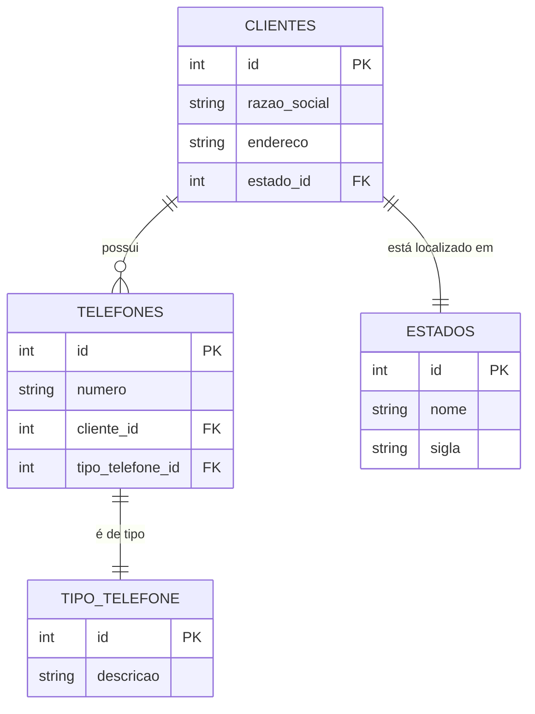

# Desafio Desenvolvedor

### 1) Observe o trecho de código:

```c
int INDICE = 12, SOMA = 0, K = 1;

enquanto K < INDICE faça
{
    K = K + 1;
    SOMA = SOMA + K;
}

imprimir(SOMA);
```

Ao final do processamento, qual será o valor da variável **SOMA**?

---

### 2) Descubra a lógica e complete o próximo elemento:

a) 1, 3, 5, 7, ___

b) 2, 4, 8, 16, 32, 64, ____

c) 0, 1, 4, 9, 16, 25, 36, ____

d) 4, 16, 36, 64, ____

e) 1, 1, 2, 3, 5, 8, ____

f) 2, 10, 12, 16, 17, 18, 19, ____

---

### 3) Faturamento

Dado um vetor que guarda o valor de faturamento diário de uma distribuidora de todos os dias de um ano, faça um programa, na linguagem que desejar, que calcule e retorne:

- O menor valor de faturamento ocorrido em um dia do ano;
- O maior valor de faturamento ocorrido em um dia do ano;
- Número de dias no ano em que o valor de faturamento diário foi superior à média anual.

#### Considerações:
- a) O vetor já está carregado com as informações de valor de faturamento.
- b) Podem existir dias sem faturamento (finais de semana e feriados). Estes dias devem ser ignorados no cálculo da média.
- c) Utilize o algoritmo mais veloz que puder definir.

---

### 4) Banco de Dados

Uma empresa solicitou a você um aplicativo para manutenção de um cadastro de clientes. Após a reunião de definição dos requisitos, as conclusões foram as seguintes:

- Um cliente pode ter um número ilimitado de telefones;
- Cada telefone de cliente tem um tipo, por exemplo: comercial, residencial, celular, etc. O sistema deve permitir cadastrar novos tipos de telefone;
- A princípio, é necessário saber apenas em qual estado brasileiro cada cliente se encontra. O sistema deve permitir cadastrar novos estados;

Você ficou responsável pela parte da estrutura de banco de dados que será usada pelo aplicativo. Assim sendo:

- Proponha um modelo lógico para o banco de dados que atenda a aplicação. Desenhe as tabelas necessárias, os campos de cada uma e marque com setas os relacionamentos entre as tabelas;
- Aponte os campos que são chave primária (**PK**) e chave estrangeira (**FK**);
- Faça uma busca utilizando comando SQL que traga o código, a razão social e o(s) telefone(s) de todos os clientes do estado de São Paulo (código “SP”).

### Resolução da questão 04

### Diagrama de entidade-relacionamento (ER) com **chaves primárias** (PK) e **chaves estrangeiras** (FK):



### Comando SQL para listar os clientes de São Paulo com seus telefones:

```sql
SELECT 
    c.id AS codigo_cliente, 
    c.razao_social, 
    t.numero AS telefone
FROM 
    CLIENTES c
JOIN 
    TELEFONES t ON c.id = t.cliente_id
JOIN 
    ESTADOS e ON c.estado_id = e.id
WHERE 
    e.sigla = 'SP';
```
---

### 5) Dois veículos, um carro e um caminhão, saem respectivamente de cidades opostas pela mesma rodovia. O carro, de Ribeirão Preto em direção a Barretos, a uma velocidade constante de 90 km/h, e o caminhão, de Barretos em direção a Ribeirão Preto, a uma velocidade constante de 80 km/h. Quando eles se cruzarem no percurso, qual estará mais próximo da cidade de Ribeirão Preto?

#### Considerações:
- a) A distância entre Ribeirão Preto e Barretos é de 125 km.
- b) Considere 3 pedágios como obstáculo, e que o carro leva 5 minutos a mais para passar em cada um deles, pois ele não possui dispositivo de cobrança de pedágio.
- c) Explique como chegou ao resultado.
